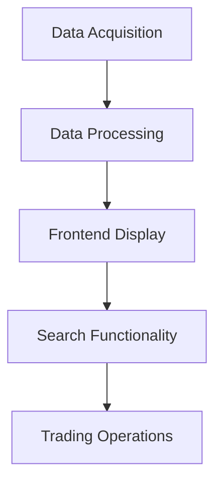
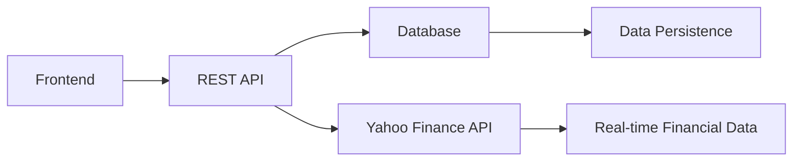

# Technical Documentation: Financial Portfolio Management System

## 1. Project Overview

### 1.1 Core Objectives

Develop a financial portfolio management system that supports multiple asset classes (stocks, funds, gold) and provides:

- Real-time and historical price trends
- Key financial indicators (volume, profit/loss)
- Portfolio performance visualization
- Searching functionality for a specific stock that client focus on
- CRUD operations for assets

### 1.2 Minimum Viable Product Implementation



**Phased Implementation Plan:**

1. **Phase 1**: Display closing price for a single stock (frontend + backend API + database + single-port data debugging)
2. **Phase 2**: Multi-asset portfolio display and basic analysis (Asset historical data + spot gold price + trading volume)  -  **these data serve as key reference indicators**
3. **Phase 3**: Searching Function  +  Trading functionality (purchase/sell) 


## FrontEndDemo - clone our project and execute page1.html in chrome(recommended)


## 2. Technical Architecture

### 2.1 Overall Architecture



### 2.2 Technology Stack

- **Frontend**: Html, JavaScript, CSS
- **Backend**: Express.js, Node.js
- **Database**: MySQL
- **External API**: Yahoo Finance API
- **Tools**: Git, JIRA, Swagger

## 3. Frontend Design

### 3.1 UI Design Principles

First design principles - user guide - show assets data and stock information (symbol + close price + volume) - volume is the key reference data to help client make a decision.

1. **Information Hierarchy**:
   - First view: Total net asset value, daily profit/loss
   - Second view: Key holdings (sorted by position value)
   - Third view: Detailed asset analysis and historical trends
2. **Core Components**: 
   - 4 cards to show assets data
   - line chart to show historical data changes - 走势
   - pie chart to show investment proportion of stock/fund/gold
3. Information Integration
   - show all information at one page
   - funtionality display at one page coperated with modal

### 3.2 Data Visualization

- Assets data: cards to show specific values
- Asset Trend: Line chart showing historical value changes
- **Asset Allocation**: Pie chart for stock/fund/gold distribution

- scrolling bar: show open price and close price of client's holding stocks
- pie chart : show investment proportion of stock/fund/gold

>  **Holdings Analysis**: Bar chart sorted by position value

### 3.3 Core Function for Usage

- search - input stock symbol - return corpration name, close price, volume and 涨幅与亏损
- purchase - click purchase button - input stock symbols and quantity - return quantity of holding stocks and update assets data

## 4. Backend Design

### 4.1 Http Request Logic


### 4.2 Database Design


### 4.3 ER Diagram


### 4.4 Core Algorithms

**Profit/Loss Calculation:**

```
function calculateProfitLoss(asset) {
  const currentValue = asset.quantity * asset.closePrice;
  const purchaseValue = asset.quantity * asset.openPrice;
  return currentValue - purchaseValue;
}
```

**Total Value Calculation:**

```
function calculateTotalValue(assets) {
  return assets.reduce((total, asset) => {
    return total + (asset.quantity * asset.currentPrice);
  }, 0);
}
```

## 5. Development Workflow

### 5.1 Git Workflow

```graph
gitGraph
    commit
    branch feature/asset-cards
    checkout feature/asset-cards
    commit
    commit
    checkout main
    merge feature/asset-cards
    branch hotfix/cors-issue
    checkout hotfix/cors-issue
    commit
    checkout main
    merge hotfix/cors-issue
```

### 5.2 JIRA Task Management

**Task Naming Convention:**

```
[BE/FE/CO]-[Type]: Short Description
```

- **BE**: Backend task
- **FE**: Frontend task
- **CO**: Cooperation task
- **Type**: Create/Feat/Docs/Fix/Test/Chore

**Examples:**

- `FE-Create: Asset card component`
- `BE-Fix: CORS configuration issue`
- `CO-Docs: Update API documentation`

### 5.3 Code Review Standards

1. Functional completeness
2. ESLint compliance
3. Performance benchmarks (API response <300ms)


## 6. API Documentation

### 6.1 API Design Principle - REST API

rest API 设计规范

### 6.2 Swagger Integration

```
swagger: "2.0"
info:
  title: Portfolio Manager API
  version: 1.0.0

paths:
  /portfolio/{userId}:
    get:
      summary: Get user portfolio
      parameters:
        - name: userId
          in: path
          required: true
          type: integer
      responses:
        200:
          description: Successfully retrieved portfolio
          schema:
            $ref: '#/definitions/Portfolio'
```

### 6.3 Endpoint Definitions

| Endpoint            | Method | Description           | Parameters    |
| ------------------- | ------ | --------------------- | ------------- |
| `/portfolio`        | GET    | Get portfolio         | userId        |
| `/assets`           | POST   | Add asset             | assetData     |
| `/assets/{id}`      | DELETE | Delete asset          | id            |
| `/history/{symbol}` | GET    | Get historical prices | symbol, range |

### 6.4 Related Interface

#### Basic Request URL

`http://localhost:3000/api_name`

#### Example Request URL

``http://localhost:3000/totalAssets``

#### Related Interface

##### 1.acquire assets data - 4 cards

Api_name : `totalAssets`

Labels: `total`

Response body:

```
[
   {
     "total": 111334.77320000001
   }
]
```

Status code 状态码：

- `200 - Request Success`
- `500 - Server Error`

---

Api_name: `totalMarketValue`

Labels: `totalMarketVaule`

Response body:

```
[
  {
    "date": "2023-07-25",
    "profit": 15000.25
  }
]
```

---

Api_name: `dailyProfitAndLoss`

Labels: ``

Response body:

---

Api_name: `totalProfitAndLoss`

Labels: ``

Response body:

---

Api_name: `weeklyProfitAndLoss`

Labels: ``

Response body:


##### 2.acquire market data - line chart

Api_name: `weeklyBondData`

Labels: ``

Response body:

```

```

---

Api_name: `weeklyGoldData`

Labels: ``

Response body:

```

```

---

Api_name: `weeklyMarketData`

Labels: ``

Response body:

---

Api_name: `weeklyStockData`

Labels: ``

Response body:

```
[
  {
    "date": "2023-07-25",
    "open": 152.25,
    "close": 155.75
  }
]
```


##### 3.acquire gold data

Api_name: `goldPriceToday`

Labels: ``

Response body:

---

Api_name: `weeklyGoldData`

Labels: ``

Response body:

##### 4.acquire scrolling data of stock

Api_name: `todayStockData`

Labels: ``

Response body:

##### 5.search data

Api_name: ``

Labels: ``

Request body:

```
{
	"symbol": "AAPL",
	"close": "159.231"
}
```

Response body:

```
[
  {
    "corp": "2023-07-25",
    "open": 152.25,
    "close": 155.75,
    "quantity":1
  }
]
```

##### Endpoint Example:

```
GET /api/totalAssets/:total
```

Response:

```
{
  "totalValue": 125000.50,
  "assets": [
    {
      "id": 1,
      "symbol": "AAPL",
      "type": "stock",
      "quantity": 100,
      "currentPrice": 175.25,
      "purchasePrice": 150.00,
      "profitLoss": 2525.00
    }
  ]
}
```


## 7. Key Problem Solutions

### 7.1 CORS Configuration

```
// Express backend configuration
app.use(cors({
  origin: process.env.CLIENT_URL,
  methods: ['GET', 'POST', 'PUT', 'DELETE'],
  allowedHeaders: ['Content-Type', 'Authorization']
}));
```

### 7.2 Data Acquisition Optimization

```
// Fetch daily stock data
async function getDailyStockData(symbol) {
  const queryOptions = {
    period1: '2020-01-01',
    period2: new Date().toISOString().split('T')[0],
    interval: '1d'
  };
  
  return yahooFinance.historical(symbol, queryOptions);
}
```

### 7.3 Data Caching Strategy

```
const NodeCache = require('node-cache');
const stockCache = new NodeCache({ stdTTL: 3600 }); // 1-hour caching

app.get('/api/stocks/:symbol', async (req, res) => {
  const { symbol } = req.params;
  const cachedData = stockCache.get(symbol);
  
  if (cachedData) return res.json(cachedData);
  
  const data = await fetchStockData(symbol);
  stockCache.set(symbol, data);
  res.json(data);
});
```

## 8. Appendices

### 8.1 Financial Formulas

- **Daily Return**: (Closing Price - Previous Close) / Previous Close
- **Volatility**: StdDev(30-day returns) × √252
- **Sharpe Ratio**: (Portfolio Return - Risk-Free Rate) / Portfolio Volatility

### 8.2 Reference Resources

1. [Yahoo Finance API Documentation](https://finance.yahoo.com/)
2. [React Performance Optimization](https://react.dev/reference/react/memo)
3. [Express Best Practices](https://expressjs.com/en/advanced/best-practice-performance.html)

------

**Document Version Control:**
 v1.0 - 2023-10-15 - Initial Release
 v1.1 - 2023-10-20 - Added Database Design Details
